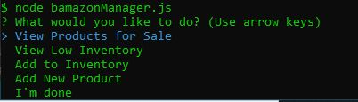
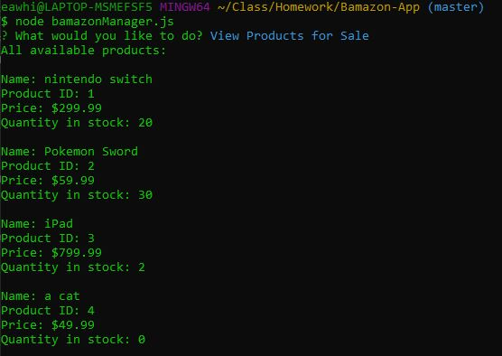
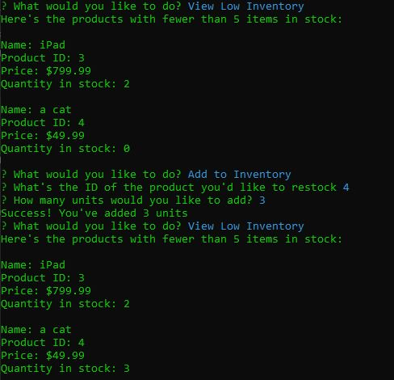
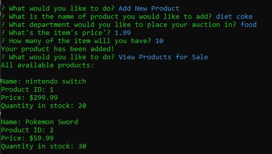
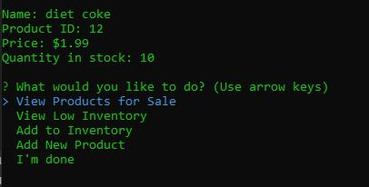

# Overview
This application uses a MySQL database and the inquery library to simulate basic functionality for an online storefront. There are two node applications with different sets of features and ways of interacting with the database. The customer app (bamazonCustomer.js) lets you vew available items, and buy items if there are enough in stock. The manager app (bamazonManager.js) lets you view items, view items that are low in stock, add to the stock of an item, and add new products. 

# Running the app

Running ```npm install``` will install the necessary mysql and inquirer packages in the directory.

Using MySQL workbench (or other sql server application), run the database-init.sql file to initiate the bamazon database with test values.

To run the customer app:
```node bamazonCustomer.js```

and follow the prompts.

to run the manager app:
```node bamazonManager.js```

and follow the prompts.

# Application in Action:

Start the customer app Shows you all of the products available for purchase, and prompts you to make a purchase or list the items again.


Here's an exmaple Run. We try to purchase an items that doesn't have enough units to buy, and we're not allowed. Instead, we purchase 3 units of a different item. Our total is displayed, and we're brought back to the starting prompt. We opt not to make another purhcase, and the app closes.


The manager app starts us by prompting which action we'd like to take.



Choosing to few the products for sale lists all of the available products, but with more info than in the customer view.



Here we view the products that are currently low in stock (less than 5 available). Seeing that the produt 'a cat" is out of stock, use the "Add to Inventory" function to add 3 units to it.



Here we add a new product, inserting it into the database.



Finally, we check to make sure that new product has been added.

